= hershey-fonts : libhersheyfont

[[kamal_titlebox]]
[width="100%",cols="<50%,<50%",]
|===
<| <a|
[width="100%",cols="<25%,<25%,<25%,<25%",]
!===
4+<! http://www.whence.com/kamal[Kamal Mostafa] kamal@whence.com
2+^! ^! ^!
!===

|===

'''''

 +

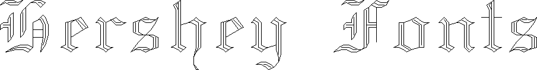

* The http://en.wikipedia.org/wiki/Hershey_font[Hershey fonts] are a
collection of free vector fonts developed circa 1967 by Dr. A. V.
Hershey.
+
This *hershey-fonts* package includes Kamal Mostafa's *libhersheyfont*
(a 2013 GPL C library for loading Hershey font files), a _gnuplot_
front-end and other utility programs, as well as the Hershey font glyph
data itself. The fonts were converted from Hershey's original NTIS
format to the .jhf Hershey file format by James Hurt.

'''''

[width="100%",cols="50%,50%",]
|===
a|
==== The hershey-fonts package

[[___plusone_0]]

Current version:

* source package:
*http://www.whence.com/hershey-fonts/hershey-fonts-0.1.tar.gz[hershey-fonts-0.1.tar.gz]* +
* git repo:
https://github.com/kamalmostafa/hershey-fonts.git[github:kamalmostafa/hershey-fonts]
* Debian package:
http://packages.qa.debian.org/h/hershey-fonts.html[hershey-fonts]
* Ubuntu PPA package:
https://launchpad.net/~kamalmostafa/+archive/hershey-fonts[ppa:kamalmostafa/hershey-fonts]

Provided binary package components:

* libhersheyfont0
* libhersheyfont-dev
* hershey-fonts-data
* hershey-font-gnuplot

a|
 +

 +
[.small]#Demo of
https://marcansoft.com/blog/2010/11/openlase-open-realtime-laser-graphics/[*OpenLase*]
enhanced with *hershey-fonts* support (upstream soon).#

|===

'''''

==== Hershey font samples

[width="100%",cols="50%,50%",]
|===
|http://www.whence.com/hershey-fonts/hershey-font-samples/astrology.png[[.small]#astrology# +
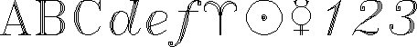] +
 +
http://www.whence.com/hershey-fonts/hershey-font-samples/cursive.png[[.small]#cursive# +
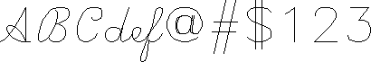] +
 +
http://www.whence.com/hershey-fonts/hershey-font-samples/cyrilc_1.png[[.small]#cyrilc++_++1# +
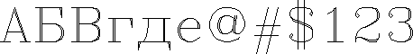] +
 +
http://www.whence.com/hershey-fonts/hershey-font-samples/cyrillic.png[[.small]#cyrillic# +
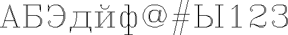] +
 +
http://www.whence.com/hershey-fonts/hershey-font-samples/futural.png[[.small]#futural# +
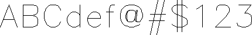] +
 +
http://www.whence.com/hershey-fonts/hershey-font-samples/futuram.png[[.small]#futuram# +
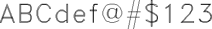] +
 +
http://www.whence.com/hershey-fonts/hershey-font-samples/gothgbt.png[[.small]#gothgbt# +
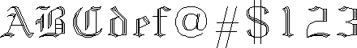] +
 +
http://www.whence.com/hershey-fonts/hershey-font-samples/gothgrt.png[[.small]#gothgrt# +
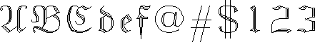] +
 +
http://www.whence.com/hershey-fonts/hershey-font-samples/gothiceng.png[[.small]#gothiceng# +
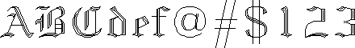] +
 +
http://www.whence.com/hershey-fonts/hershey-font-samples/gothicger.png[[.small]#gothicger# +
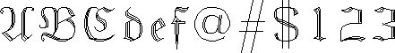] +
 +
http://www.whence.com/hershey-fonts/hershey-font-samples/gothicita.png[[.small]#gothicita# +
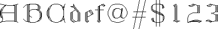] +
 +
http://www.whence.com/hershey-fonts/hershey-font-samples/gothitt.png[[.small]#gothitt# +
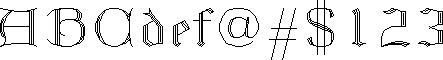] +
 +
http://www.whence.com/hershey-fonts/hershey-font-samples/greekc.png[[.small]#greekc# +
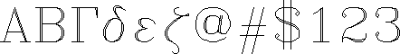] +
 +
http://www.whence.com/hershey-fonts/hershey-font-samples/greek.png[[.small]#greek# +
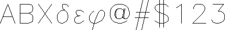] +
 +
http://www.whence.com/hershey-fonts/hershey-font-samples/greeks.png[[.small]#greeks# +
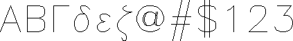] +
 +
http://www.whence.com/hershey-fonts/hershey-font-samples/japanese.png[[.small]#japanese# +
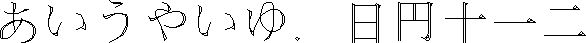] +
 +
|http://www.whence.com/hershey-fonts/hershey-font-samples/markers.png[[.small]#markers# +
] +
 +
http://www.whence.com/hershey-fonts/hershey-font-samples/mathlow.png[[.small]#mathlow# +
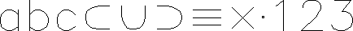] +
 +
http://www.whence.com/hershey-fonts/hershey-font-samples/mathupp.png[[.small]#mathupp# +
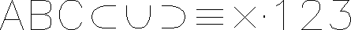] +
 +
http://www.whence.com/hershey-fonts/hershey-font-samples/meteorology.png[[.small]#meteorology# +
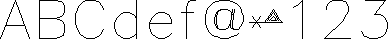] +
 +
http://www.whence.com/hershey-fonts/hershey-font-samples/music.png[[.small]#music# +
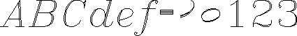] +
 +
http://www.whence.com/hershey-fonts/hershey-font-samples/rowmand.png[[.small]#rowmand# +
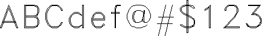] +
 +
http://www.whence.com/hershey-fonts/hershey-font-samples/rowmans.png[[.small]#rowmans# +
image:./index_files/rowmans-preview.png[./index++_++files/rowmans-preview]] +
 +
http://www.whence.com/hershey-fonts/hershey-font-samples/rowmant.png[[.small]#rowmant# +
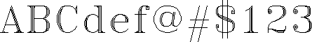] +
 +
http://www.whence.com/hershey-fonts/hershey-font-samples/scriptc.png[[.small]#scriptc# +
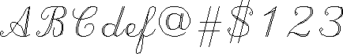] +
 +
http://www.whence.com/hershey-fonts/hershey-font-samples/scripts.png[[.small]#scripts# +
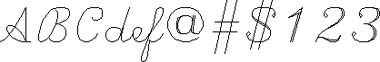] +
 +
http://www.whence.com/hershey-fonts/hershey-font-samples/symbolic.png[[.small]#symbolic# +
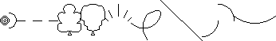] +
 +
http://www.whence.com/hershey-fonts/hershey-font-samples/timesg.png[[.small]#timesg# +
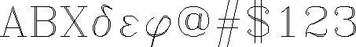] +
 +
http://www.whence.com/hershey-fonts/hershey-font-samples/timesib.png[[.small]#timesib# +
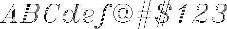] +
 +
http://www.whence.com/hershey-fonts/hershey-font-samples/timesi.png[[.small]#timesi# +
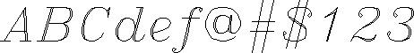] +
 +
http://www.whence.com/hershey-fonts/hershey-font-samples/timesrb.png[[.small]#timesrb# +
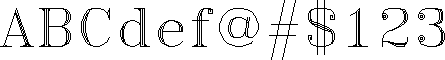] +
 +
http://www.whence.com/hershey-fonts/hershey-font-samples/timesr.png[[.small]#timesr# +
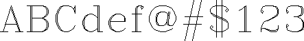] +
 +
|===

'''''

[.small]#The *libhersheyfont* library is Copyright © 2013 by Kamal
Mostafa ++<++kamal@whence.com++>++, licensed GPLv2{plus}: GNU GPL
version 2 or later ++<++http://gnu.org/licenses/gpl.html++>++. +
The Hershey font glyph data is covered by a permissive use and
redistribution license. +
This is free software: you are free to change and redistribute it. There
is NO WARRANTY, to the extent permitted by law.#

[.small]##
